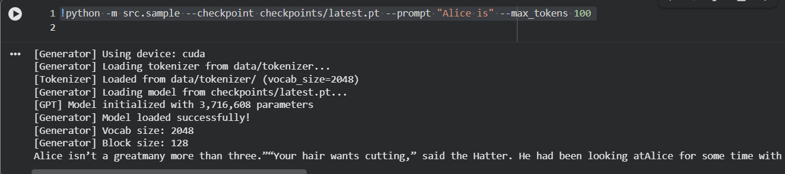

# ScratchGPT: A GPT-Style LLM From Scratch

A complete, educational implementation of a GPT-style language model built from scratch using only PyTorch and standard Python libraries. No HuggingFace Trainer, no nanoGPT copying – just clean, readable code.

## Features

- **Byte-level BPE tokenizer** - Custom implementation with training, encoding, and decoding
- **Decoder-only Transformer** - Multi-head attention, MLP, LayerNorm, residual connections
- **Training loop** - Mixed precision, gradient accumulation, cosine LR schedule, checkpointing
- **Text generation** - Temperature, top-k, top-p (nucleus) sampling
- **GGUF export** - Convert to llama.cpp format for efficient CPU inference
- **Fine-tuning support** - Fine-tune on custom datasets like NVD (National Vulnerability Database)

## Screenshots

### Training Progress
Final stage of the training loop showing loss convergence:


### Text Generation
Model completing a prompt correctly:



## Pre-trained Weights

A pre-trained `latest.pt` checkpoint is available in the repository. You can use it directly for text generation without training:

```bash
python -m src.sample --checkpoint checkpoints/latest.pt --prompt "Your prompt here" --max_tokens 100
```

> **Note:** Training data is not included in this repository (gitignored due to size). If you want to train from scratch, download the data using `./scripts/download_data.sh`. The model was trained on the [TinyStories](https://huggingface.co/datasets/roneneldan/TinyStories) dataset.

---

## Fine-Tuning on Exploit Database Dataset

ScratchGPT can be fine-tuned on the [Exploit Database Dataset](https://huggingface.co/datasets/darkknight25/Exploit_Database_Dataset) to learn about cybersecurity vulnerabilities, CVEs, and exploit analysis.

### Dataset Overview

The Exploit Database Dataset contains ~1400 curated entries of cybersecurity vulnerabilities (2021-2025):
- **CVE IDs** - Vulnerability identifiers (e.g., CVE-2024-30157)
- **Descriptions** - Technical explanations of vulnerabilities
- **Vulnerability Types** - RCE, XSS, SQL Injection, Path Traversal, DoS, etc.
- **Platforms** - Web, Software, Network, Mobile, IoT
- **Proof of Concepts** - Actual exploit code and commands

Dataset source: [darkknight25/Exploit_Database_Dataset on Hugging Face](https://huggingface.co/datasets/darkknight25/Exploit_Database_Dataset)

### Fine-Tuning Approach

#### 1. Data Preparation
The script downloads the Exploit Database Dataset and formats CVE records into conversational training examples:

```
<|user|>What is CVE-2024-30157?<|assistant|>CVE-2024-30157: Windows Task Scheduler - RCE. Task Scheduler flaw in Windows allows unauthenticated RCE.

<|user|>What type of vulnerability is CVE-2019-5418?<|assistant|>CVE-2019-5418 is a Path Traversal vulnerability affecting Web systems. Path traversal in Action View allows file disclosure via crafted accept headers.

<|user|>Show the proof of concept for CVE-2019-7671<|assistant|>PoC for CVE-2019-7671 (Stored XSS):
POST /bin/sysfcgi.fx HTTP/1.1
Host: 192.168.13.37
Content-Type: application/x-www-form-urlencoded
<param name="HwName" value="<script>alert('XSS')</script>"/>
```

#### 2. Training Strategy
- **Full fine-tuning** - All model weights are updated (no LoRA/adapters)
- **Lower learning rate** - 1e-4 vs 3e-4 for pre-training
- **Shorter training** - 2000 steps typically sufficient
- **Mixed precision** - FP16/BF16 for memory efficiency

#### 3. Hardware Requirements
Optimized for **Google Colab T4 GPU** (16GB VRAM):

| Setting | Value | Purpose |
|---------|-------|---------|
| Batch size | 8 | Fits in 16GB VRAM |
| Gradient accumulation | 8 | Effective batch = 64 |
| Block size | 256 | Context length |
| Mixed precision | FP16 | Memory savings |

### Quick Start: Fine-Tuning

```bash
# 1. Prepare the Exploit Database Dataset (downloads from Hugging Face)
python scripts/prepare_cyberexploit_data.py

# 2. Fine-tune the model
python scripts/finetune_cyberexploit.py --preset small --max_steps 3000

# 3. Test the fine-tuned model
python -m src.sample \
    --checkpoint checkpoints/cyberexploit/best_cyberexploit.pt \
    --tokenizer data/cyberexploit/tokenizer \
    --prompt "<|user|>What is CVE-2024-30157?<|assistant|>"
```

### Google Colab Fine-Tuning

Use the provided notebook: `notebooks/finetune_cyberexploit_colab.ipynb`

```python
# In Colab:

# Step 1: Prepare Exploit Database Dataset (downloads from Hugging Face)
!pip install datasets -q
!python scripts/prepare_cyberexploit_data.py --vocab_size 8192

# Step 2: Fine-tune (takes ~30-60 min on T4)
!python scripts/finetune_cyberexploit.py \
    --data_dir data/cyberexploit \
    --preset small \
    --batch_size 8 \
    --grad_accum 8 \
    --max_steps 3000

# Step 3: Test generation
!python -m src.sample \
    --checkpoint checkpoints/cyberexploit/best_cyberexploit.pt \
    --tokenizer data/cyberexploit/tokenizer \
    --prompt "<|user|>What is CVE-2024-30157?<|assistant|>" \
    --max_tokens 200
```

### Quantization Options

After fine-tuning, convert to GGUF for efficient inference:

```bash
# Export model
./scripts/export.sh --checkpoint checkpoints/cyberexploit/best_cyberexploit.pt

# Convert to GGUF (F16)
./scripts/gguf_convert.sh exports/scratchgpt

# Quantize to Q4_K_M (recommended for 8GB RAM)
./scripts/gguf_quantize.sh exports/scratchgpt/model-f16.gguf
```

#### Quantization Formats

| Format | Size | Quality | Use Case |
|--------|------|---------|----------|
| F16 | 100% | Best | GPU inference |
| Q8_0 | ~50% | Excellent | High-end CPU |
| Q4_K_M | ~25% | Good | Standard CPU (8GB RAM) |
| Q4_0 | ~25% | Fair | Low memory systems |

### Fine-Tuning Results

After fine-tuning on the Exploit Database Dataset, the model can:
- Explain CVE vulnerabilities in plain language
- Classify vulnerability types (RCE, XSS, SQLi, etc.)
- Generate security advisories
- Describe affected platforms
- Provide proof-of-concept exploit information

Example output:
```
User: What is CVE-2024-30157?
Assistant: CVE-2024-30157: Windows Task Scheduler - RCE. Task Scheduler flaw
in Windows allows unauthenticated remote code execution.

User: What type of vulnerability is CVE-2019-5418?
Assistant: CVE-2019-5418 is a Path Traversal vulnerability affecting Web
systems. Path traversal in Action View allows file disclosure via crafted
accept headers with 'render file:' calls.

User: What is the severity of CVE-2019-7671?
Assistant: MEDIUM - CVE-2019-7671 is a Stored XSS vulnerability. Authenticated
attacker injects JavaScript via 'HwName' parameter, causing stored XSS.
```

---

## Project Structure

```
LLM_From_Scratch/
├── src/
│   ├── config.py           # Configuration management
│   ├── model.py            # GPT model implementation
│   ├── train.py            # Training loop
│   ├── sample.py           # Text generation
│   ├── dataset.py          # Memmap dataset handling
│   ├── export_hf.py        # Export for GGUF conversion
│   └── tokenizer/
│       ├── byte_bpe.py     # BPE tokenizer implementation
│       └── train_bpe.py    # Tokenizer training script
├── scripts/
│   ├── download_data.sh    # Download training data
│   ├── prepare_data.py     # Data preparation logic
│   ├── prepare_cyberexploit_data.py  # CyberExploitDB preparation
│   ├── finetune_cyberexploit.py      # Fine-tuning script
│   ├── train_colab.sh      # Training script for Colab
│   ├── export.sh           # Export model
│   ├── gguf_convert.sh     # Convert to GGUF
│   ├── convert_to_gguf.py  # Custom GGUF converter
│   ├── gguf_quantize.sh    # Quantize GGUF model
│   └── run_llamacpp.sh     # Run inference with llama.cpp
├── notebooks/
│   ├── train_colab.ipynb              # Training notebook
│   └── finetune_cyberexploit_colab.ipynb  # Fine-tuning notebook
├── images/                 # Screenshots
├── checkpoints/            # Model weights
├── requirements.txt
├── .gitignore
└── README.md
```

---

## Quick Start

Run this sequence to validate everything works:

```bash
# 1. Install dependencies
pip install -r requirements.txt

# 2. Download tiny dataset (~5MB)
./scripts/download_data.sh --tiny

# 3. Prepare tokenizer + tokens
python scripts/prepare_data.py --vocab_size 2048 --max_lines 5000

# 4. Train for 200 steps (CPU, ~2-3 min)
python -m src.train --preset toy --max_steps 200 --batch_size 8 --grad_accum 1

# 5. Generate text
python -m src.sample --checkpoint checkpoints/best.pt --prompt "Once upon a time" --max_tokens 50

# 6. Export for GGUF
./scripts/export.sh

# 7. Convert to GGUF (requires llama.cpp)
./scripts/gguf_convert.sh exports/scratchgpt

# 8. Quantize to Q4_K_M
./scripts/gguf_quantize.sh exports/scratchgpt/model-f16.gguf

# 9. Run with llama.cpp
./scripts/run_llamacpp.sh exports/scratchgpt/model-q4_k_m.gguf "Hello"
```

---

## Detailed Usage

### 1. Install Dependencies

```bash
pip install -r requirements.txt
```

**Required:** `torch`, `numpy`, `tqdm`
**Optional:** `safetensors` (for model export), `matplotlib` (for visualization)

### 2. Download Training Data

```bash
# Tiny dataset (~5MB) - for quick testing
./scripts/download_data.sh --tiny

# Small dataset (~50MB) - for toy model training
./scripts/download_data.sh --small

# Medium dataset (~200MB) - for serious training
./scripts/download_data.sh --medium
```

### 3. Prepare Data

```bash
# Default settings (vocab_size=4096)
python scripts/prepare_data.py

# Custom vocab size
python scripts/prepare_data.py --vocab_size 8192

# Quick test with limited data
python scripts/prepare_data.py --max_lines 10000
```

This will:
1. Clean the raw text
2. Train a BPE tokenizer
3. Encode text to binary tokens (memmap format)

### 4. Train the Model

#### Local CPU Training (Slow)

```bash
# Toy model, 500 steps
python -m src.train --preset toy --max_steps 500 --batch_size 16 --grad_accum 2 --no_amp
```

#### Local GPU Training

```bash
# Toy model with mixed precision
python -m src.train --preset toy --max_steps 2000

# Small model, longer training
python -m src.train --preset small --max_steps 10000 --batch_size 32 --grad_accum 4
```

#### Google Colab Training

1. Mount Google Drive:
```python
from google.colab import drive
drive.mount('/content/drive')
```

2. Clone and setup:
```bash
!git clone <your-repo-url> /content/LLM_From_Scratch
%cd /content/LLM_From_Scratch
!pip install -r requirements.txt
```

3. Download and prepare data:
```bash
!./scripts/download_data.sh --small
!python scripts/prepare_data.py
```

4. Train:
```bash
!./scripts/train_colab.sh toy    # Quick test
!./scripts/train_colab.sh small  # Full training
```

Checkpoints are saved to Google Drive automatically.

### 5. Generate Text

```bash
# Single generation
python -m src.sample --checkpoint checkpoints/best.pt --prompt "The quick brown fox"

# Interactive mode
python -m src.sample --checkpoint checkpoints/best.pt --interactive

# Streaming output
python -m src.sample --checkpoint checkpoints/best.pt --prompt "Hello" --stream

# Adjust sampling parameters
python -m src.sample -c checkpoints/best.pt -p "Once upon" \
    --temperature 0.7 --top_k 40 --top_p 0.9 --max_tokens 200
```

### 6. Export and Convert to GGUF

```bash
# Export to HF-like format
./scripts/export.sh

# Convert to GGUF
./scripts/gguf_convert.sh exports/scratchgpt

# Quantize to Q4_K_M (recommended for 8GB RAM)
./scripts/gguf_quantize.sh exports/scratchgpt/model-f16.gguf

# Run with llama.cpp
./scripts/run_llamacpp.sh exports/scratchgpt/model-q4_k_m.gguf "Your prompt here"
```

---

## Model Presets

| Preset | Layers | Heads | Dim | Context | Est. Params |
|--------|--------|-------|-----|---------|-------------|
| toy    | 4      | 4     | 256 | 128     | ~3M         |
| small  | 8      | 8     | 512 | 256     | ~25M        |

---

## Training Tips

### Out of Memory (OOM) Solutions

1. **Reduce batch size**: `--batch_size 8`
2. **Increase gradient accumulation**: `--grad_accum 8`
3. **Reduce block size**: `--block_size 64`
4. **Reduce vocab size**: `--vocab_size 2048` when preparing data
5. **Disable mixed precision on CPU**: `--no_amp`

### Improving Results

1. **More data**: Use `--medium` or gather more text
2. **Longer training**: Increase `--max_steps`
3. **Larger model**: Use `--preset small` (needs GPU)
4. **Lower learning rate**: `--lr 1e-4`
5. **More warmup**: `--warmup_steps 200`

---

## Architecture Details

### Attention Implementation

The attention module includes both:
- **Pure implementation**: Explicit Q,K,V projections, scaled dot-product, masking
- **Fused implementation**: Uses `torch.nn.functional.scaled_dot_product_attention` when available

```python
# Causal mask is registered as buffer for efficiency
mask = torch.tril(torch.ones(block_size, block_size))
self.register_buffer("mask", mask)

# During forward pass
scores = scores.masked_fill(mask == 0, float('-inf'))
```

### Weight Tying

Token embedding and LM head share weights:
```python
self.tok_emb.weight = self.lm_head.weight
```

### AdamW Configuration

Weight decay is NOT applied to:
- Bias parameters
- LayerNorm parameters
- Embedding weights

---

## Project Constraints

This project is designed to work within these constraints:

- **8GB RAM** - Using memmap datasets, streaming tokenization
- **5GB disk** - Data and checkpoints are gitignored, small default vocab
- **No GPU locally** - Training happens on Colab, local is for testing
- **No HuggingFace dependencies** - Pure PyTorch implementation

### Why Memmap?

Memmap allows accessing large token files without loading into RAM:
```python
# Only loads what's accessed, not the full array
self.data = np.memmap(path, dtype=np.uint16, mode="r")
```

---

## Files Not in Git

These directories are gitignored (create locally or on Colab):
- `data/` - Raw text and tokenized data
- `checkpoints/` - Model checkpoints
- `exports/` - Exported models
- `llama.cpp/` - llama.cpp clone for GGUF conversion

---

## Troubleshooting

### "CUDA out of memory"
- Reduce `--batch_size`
- Increase `--grad_accum`
- Use `--preset toy`

### "Tokenizer not found"
- Run `python scripts/prepare_data.py` first

### "llama.cpp not found"
- Run `./scripts/gguf_convert.sh` to clone and build it

### Slow training on CPU
- This is expected. Use Colab for real training.
- For testing, use `--max_steps 100` and small batch size

### Poor generation quality
- Train longer
- Use more data
- Try different sampling parameters (lower temperature)

---

## License

MIT License - Use freely for learning and experimentation.

## Acknowledgments

Inspired by:
- [Attention Is All You Need](https://arxiv.org/abs/1706.03762)
- [GPT-2 Paper](https://cdn.openai.com/better-language-models/language_models_are_unsupervised_multitask_learners.pdf)
- [llama.cpp](https://github.com/ggerganov/llama.cpp)
- [minGPT](https://github.com/karpathy/minGPT)
- [Exploit Database Dataset](https://huggingface.co/datasets/darkknight25/Exploit_Database_Dataset) by darkknight25

Built from scratch for educational purposes.
